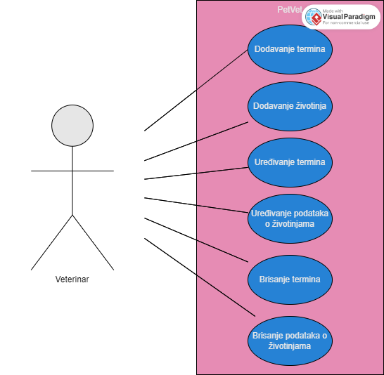

## PetVet 

PetVet je aplikacija napravljena za veterinare. Omogućava dodavanje, uređivanje, brisanje te pregled informacija o terminima i podatcima o životinjama.

## Usecase



## Instalacija i pokretanje
Prije svega mora biti instaliran Docker Desktop na računalu.
```
cd ~/Downloads
git clone https://github.com/LukaRitosa/PetVet
cd petvet
```
```
docker build --tag petvet:1.2 .
docker run -p 5001:8080 petvet:1.2  
```
Aplikaciju otvarate preko linka na aktivnom Docker kontenjeru pod **Port(s)** ili u web pregledniku upišite: "localhost:5001".
